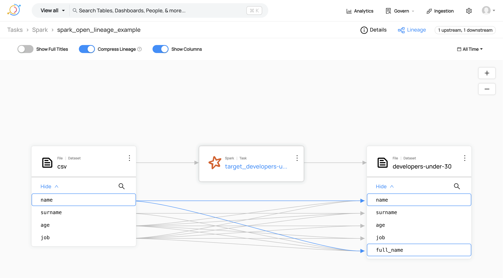

# Spark DataHub demo

> __⭐️ This project demonstrates how to emit metadata from a Spark job to DataHub.__

For this purpose, this repository __executes a Spark job__ that reads a CSV file, filters and transforms the data,
and writes the output to a new CSV file.

To __emit metadata__, it uses and __compares two different Spark event listeners:__
* __[OpenLineage (openlineage-spark)](https://openlineage.io/docs/integrations/spark/)__
* __[DataHub (acryl-spark-lineage)](https://datahubproject.io/docs/metadata-integration/java/acryl-spark-lineage)__

<p align="center">
   
</p>

## 1. Start DataHub

1. [Install Docker Desktop](https://www.docker.com/products/docker-desktop/)
2. Start Docker Desktop
3. Install Python 3.8+: [Download it from the official site](https://www.python.org/downloads/)
   or use [pyenv](https://github.com/pyenv/pyenv) to install it (recommended)
4. Verify python: `python3 --version` (version must be 3.8+)
5. [Install pipenv](https://pipenv.pypa.io/en/latest/installation.html): `pip3 install --user pipenv`
   (you may need to update your path)
6. Verify pipenv: `pipenv --version`
7. Create a new pipenv shell: `pipenv shell`
8. Install DataHub CLI
   ```shell
   pipenv install acryl-datahub
   datahub version
   ```
9. Start DataHub
   ```shell
   datahub docker quickstart
   ```
   This downloads a Docker Compose file to your home directory (`~/.datahub/quickstart`)
   and runs it to start all associated containers.
   > On Mac computers with Apple Silicon (M1, M2 etc.), you might see an error like `no matching manifest for
   > linux/arm64/v8 in the manifest list entries`. This typically means that the datahub cli was not able to
   > detect that you are running it on Apple Silicon. To resolve this issue, override the default architecture
   > detection by issuing `datahub docker quickstart --arch m1`
10. Sign In: navigate to the DataHub UI at http://localhost:9002 in your browser
    ```
    username: datahub
    password: datahub
    ```
11. (Optional) In a new browser tab, navigate to the [DataHub Swagger UI](http://localhost:8080/openapi/swagger-ui/index.html)
    to inspect the DataHub REST API. To view the OpenLineage API definition, navigate to
    [this page](http://localhost:8080/openapi/swagger-ui/index.html?urls.primaryName=OpenLineage) or select `OpenLineage`
    in the upper right corner of the Swagger UI (in the dropdown next to the `Select a definition` message).

🚀 That's it!

<details>

<summary>⚙️ Common Operations</summary> 

* Stop DataHub: `datahub docker quickstart --stop`
* Reset DataHub: `datahub docker nuke`
* Upgrade DataHub: `datahub docker quickstart`
* Back up DataHub: `datahub docker quickstart --backup`
* Restore DataHub: `datahub docker quickstart --restore`

</details>

## 2. Execute one of the Spark examples

This project contains 2 maven submodules. Both execute a Spark job locally and emit metadata in the respective format:

* [datahub](datahub/README.md): Uses `DatahubSparkListener` to emit metadata in DataHub format
* [openlineage](openlineage/README.md): Uses `OpenLineageSparkListener` to emit metadata in OpenLineage format

Execute one of them by following the instructions specified in the respective README.

## 3. Verify metadata in DataHub

In your browser, navigate to [this page](http://localhost:9002/tasks/urn:li:dataJob:%28urn:li:dataFlow:%28spark,spark_open_lineage_example,spark_namespace%29,spark_open_lineage_example.execute_insert_into_hadoop_fs_relation_command.target_developers-under-30%29/Lineage?end_time_millis&filter_degree___false___EQUAL___0=1&is_lineage_mode=true&page=1&separate_siblings=false&show_columns=true&start_time_millis&unionType=0)
to visualize the lineage of the Spark task you executed in the previous step (the one that reads the input csv file,
filters and transforms the data, and writes the output to a new csv file).


## 4. Stop / Reset DataHub

When you're done, if you just want to __stop DataHub__, then run the following command:

```shell
datahub docker quickstart --stop
```

This will stop all the Docker containers.

If you want to __clean up the environment and stop DataHub__ instead, then run the following command:

```shell
datahub docker nuke
```

This will remove all the containers and volumes associated with the DataHub services, thereby deleting all the metadata.
As a result, DataHub will also be stopped.

If you want to __start DataHub again__, follow the steps specified in the [Start DataHub section](#1-start-datahub),
starting from the following command:

```shell
datahub docker quickstart
```
