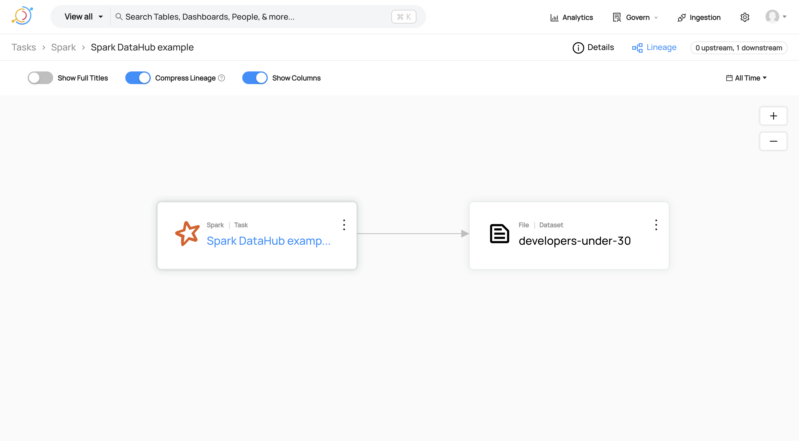
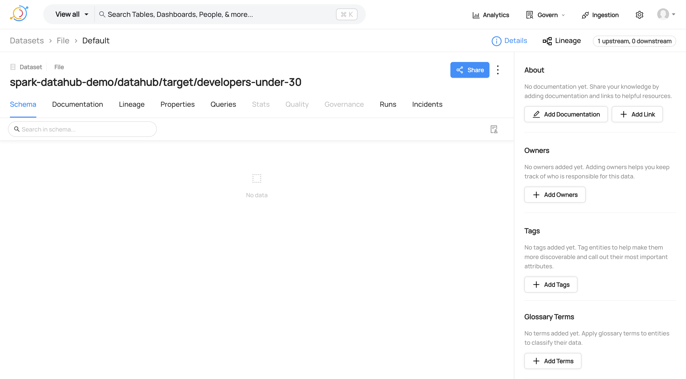

# Spark DataHub example

Unlike OpenLineage, DataHub Spark listener does not have a composite emitter that allows
sending events to multiple destinations. Therefore, you must choose the emitter type to use:

* `file`: Writes the events to a file. Run `SparkDatahubExample (file)` in IntelliJ.
* `rest`: Sends the events to DataHub using its REST API. Run `SparkDatahubExample (rest)` in IntelliJ.

You can execute one after the other.

You should see the following messages in the logs:

```
DEBUG datahub.spark.DatahubSparkListener - loadDatahubConfig completed successfully
INFO datahub.spark.DatahubSparkListener - onApplicationStart completed successfully
```

## Results

| 🚨 | It does not work as expected! |
|----|:------------------------------|

DataHub Spark listener __is NOT able to capture and show in DataHub all the information about the Spark job execution__:
it only shows the spark job and the output dataset. It does not show the input dataset, column-level-lineage,
dataset schemas, ...

Moreover, __it generates events in DataHub format, which only DataHub can understand__. OpenLineage, on the other hand,
is an open format that can be used by other tools, not just DataHub.




