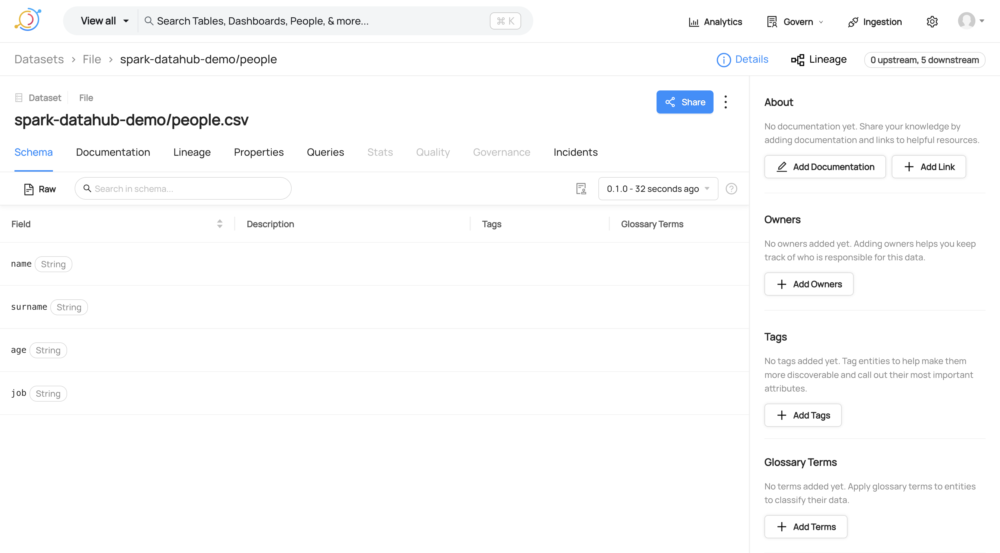
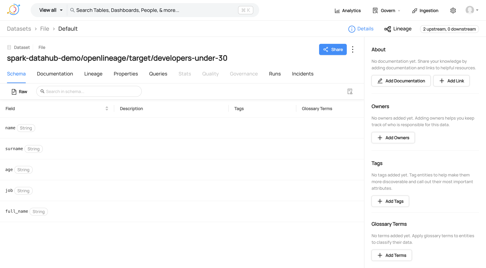

# Spark OpenLineage example

Run `SparkOpenLineageExample` in IntelliJ.

You should see the following messages in the logs:

```
INFO SparkContext: Registered listener io.openlineage.spark.agent.OpenLineageSparkListener
INFO EventEmitter: Emitting lineage completed successfully with run id: ...
```

## Results

| ✅ | It works better than expected! |
|---|:-------------------------------|

OpenLineage Spark listener __is able to capture and show in DataHub all the information about the Spark job execution__:
input and output datasets (with their schemas), job info, job tasks, __column-level-lineage__, ...

Moreover, OpenLineage is an __open format__ that can be used by other tools, not just DataHub.
This is a big advantage over the DataHub Spark listener.





