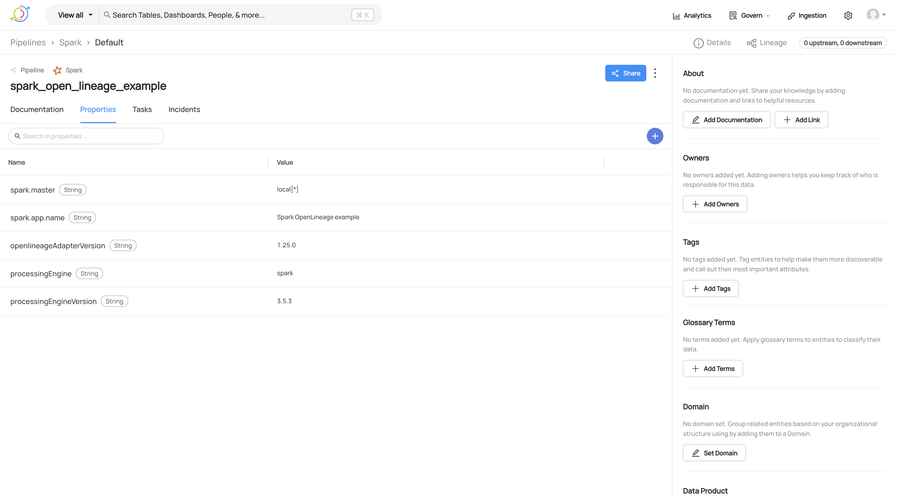
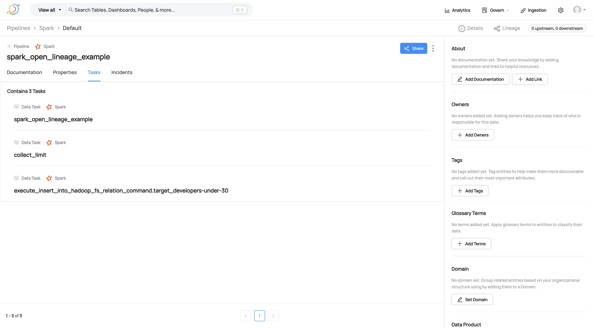

# Spark OpenLineage example

Run `SparkOpenLineageExample` in IntelliJ.

You should see the following messages in the logs:

```
INFO SparkContext: Registered listener io.openlineage.spark.agent.OpenLineageSparkListener
INFO EventEmitter: Emitting lineage completed successfully with run id: ...
```

## Results

| ✅ | It works better than expected! |
|---|:-------------------------------|

OpenLineage Spark listener __is able to capture and show in DataHub all the information about the Spark job execution__:
input and output datasets (with their schemas), job info, job tasks, __column-level-lineage__, ...

Moreover, OpenLineage is an __open format__ that can be used by other tools, not just DataHub.
This is a big advantage over the DataHub Spark listener.


| 👎 | Downsides |
|----|:----------|

The only __downside__ is that __it's not easy to understand the Spark job execution plan__ from the lineage:





From this info it's not really clear what the Spark job is doing under the hood. We can only see the Spark job
properties and the tasks that were executed.

The __Spline UI__ is much better at showing the Spark job execution plan.
Take a look at the [Spline example](../spline/README.md) to see how it looks like.
