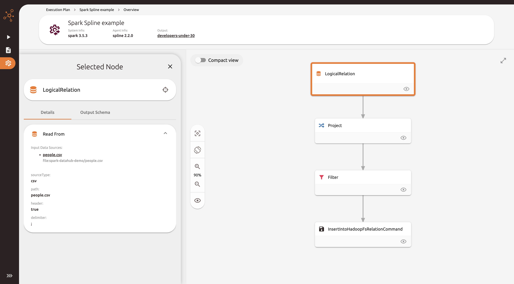

# Spark Spline example

## Context

__This module has a different purpose__ than the other modules in this repository.

Instead of trying to emit lineage to DataHub, this module shows __how to emit lineage in [Spline](https://absaoss.github.io/spline/)
format to the Spline server__, and how to __visualize it in the Spline UI__.

The initial idea was to compare the format of the jsons emitted by the OpenLineage Spark listener with the format of
the jsons emitted by the Spline QueryExecution listener. But that idea evolved into a full example of how to use Spline,
which serves to easily analyze which information is captured by Spline, and also compare how DataHub and Spline visualize lineage.

## How to run

You must stop DataHub before running this example. To do so, run the following command:

```shell
datahub docker quickstart --stop
```

Then, you have to start Spline server, by running the following command in the `spline` directory:

```shell
docker compose up
```

After all the services are up, you can run the `SparkSplineExample` in IntelliJ.

You should see the following message in the logs:

```
INFO SparkLineageInitializer: Spline successfully initialized. Spark Lineage tracking is ENABLED.
```

Then, navigate to the DataHub UI at http://localhost:9090 in your browser.

You should see the `Spark Spline example` execution event.

When you are done, you can stop Spline by running the following command in the `spline` directory:

```shell
docker compose down
```

## Results

| 😐 | Better at showing the Spark job execution plan but worst at global lineage |
|----|:---------------------------------------------------------------------------|

Spline __excels at showing the Spark job execution plan__, with a lot of detail about the Spark job internal operations:





But __it is not able to show column-level-lineage at the global visualization__:


__It can only show attribute lineage for a single field__ when you select it in the Spline UI:


Also, __it is only able to show dataset schema for the output dataset__:


